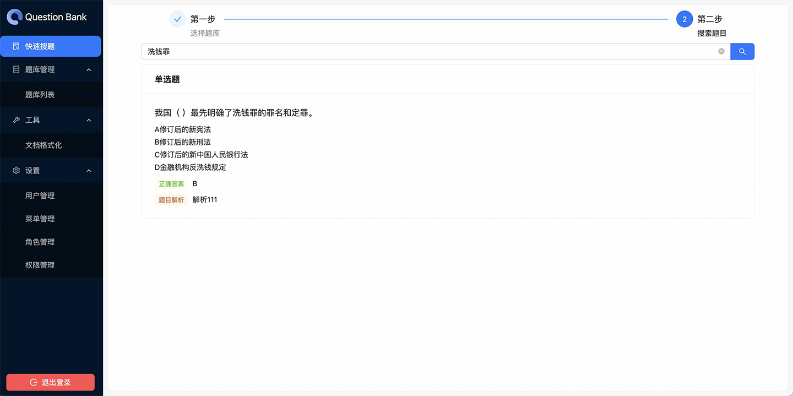

<div align="center">


<h1>Question Bank Management System</h1>

English · [中文](./README-zh_CN.md)

</div>

## ✨ Introduction

A Next.js-based web application for managing question banks. It includes user management, allowing users with the appropriate permissions to import question banks, create, edit, delete, and search questions. The system offers a user-friendly interface for managing the question banks.



## 🎨 Features

- Search questions
- Question bank management
- Question management
- User management
- Role management
- Permission management
- Menu management

## 🔨 Tech Stack

- Framework: Next.js + React
- UI Library: Ant Design
- User Authentication: NextAuth.js
- ORM: Prisma
- Database: MySQL

## 📦 Usage

`node>=18.17.0`

### Installation

```bash
pnpm install
```

### Development

```bash
pnpm dev
```

### Build

```bash
pnpm build
```
